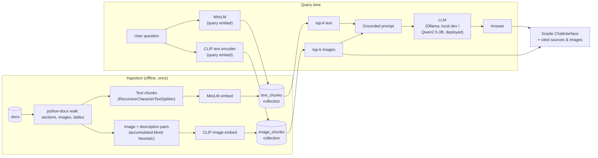

# Multimodal RAG Chatbot

A multimodal retrieval-augmented chatbot that answers questions over a real internal
utility-industry reference document — combining **text retrieval** (MiniLM) and **image
retrieval** (CLIP) so answers can be grounded in both written rules and the field-photo
examples embedded in the source doc, with every answer citing the section and image it
came from.

**[Live demo](https://huggingface.co/spaces/suman246/multimodal-rag-chatbot)** — currently
access-restricted, since the source document contains real internal company references
(see [Known limitations](#known-limitations)); happy to grant access on request. The code,
architecture, and evaluation below stand on their own regardless.

No paid API keys anywhere — every model (embeddings and generation) is open-weight.

## Architecture



ChromaDB persists both collections to disk (`data/chroma_db/`, shipped in this repo so the
deployed app starts instantly — no re-ingestion needed). `rag/pipeline.py`'s `RagPipeline`
is the single class both `rag/cli.py` (local testing) and `app/app.py` (the deployed UI)
call into — one retrieval+generation implementation, two front ends.

## Tech stack & why

| Piece | Choice | Why |
|---|---|---|
| Doc parsing | `python-docx`, direct XML body walk | Needed to track heading context and resolve inline image relationships in document order — `langchain`'s `Docx2txtLoader` flattens to plain text and drops images entirely |
| Text embeddings | `sentence-transformers/all-MiniLM-L6-v2` | Small, fast, no API key, well-proven for short-passage retrieval |
| Image embeddings | `openai/clip-vit-base-patch32` (open HF weights) | Joint text/image embedding space — a plain text query can retrieve images directly via CLIP's text encoder, no separate captioning step needed |
| Vector store | ChromaDB, persistent local client | Zero ops, embeddable, no server process to run or pay for |
| Chunking | `langchain-text-splitters` only (not full `langchain`) | Just need `RecursiveCharacterTextSplitter` — pulling in the whole framework for one utility is unnecessary weight |
| Generation (local dev) | Ollama, swappable model | Fully local, no API key, trivial to try different models |
| Generation (deployed) | Qwen2.5-3B-Instruct via `transformers`, CPU | See [Deployment](#deployment-hugging-face-spaces) below — the original plan (ZeroGPU-accelerated) hit a platform issue |
| UI | Gradio `ChatInterface` | Minimal code for a citation-rendering chat UI, native to HF Spaces |
| Hosting | HF Spaces, ZeroGPU hardware tier | The only free tier for a personal account's Gradio Space right now (plain CPU Basic requires a paid plan) |

## Project structure

```
data/
  raw/          source .docx
  images/       images extracted from the source doc during ingestion
  chroma_db/    persistent Chroma vector store (shipped in the repo via git-lfs)
ingest/         ingestion pipeline (parsing, chunking, embedding, indexing)
rag/            retrieval + generation pipeline (pipeline.py) and a CLI test harness (cli.py)
app/            Gradio chat UI (app.py)
eval/           retrieval evaluation set + harness (eval_set.json, evaluate.py)
```

## Build phases

1. **Ingestion** — parse the docx into text chunks and image+description pairs, embed, persist to ChromaDB.
2. **Retrieval + generation** — `RagPipeline`: embed the query per modality, pull top-k from both collections, generate a grounded answer.
3. **Chat UI** — Gradio `ChatInterface` with inline source images and section citations.
4. **Evaluation** — hand-labeled ground truth, precision@k/recall@k, limitations verified by inspecting actual retrieved images.
5. **Deployment** — HF Spaces, swapped local Ollama for an in-process model so the whole thing runs with zero paid dependencies end to end.

## Setup

```bash
python -m venv .venv
.venv\Scripts\activate       # Windows
pip install -r requirements.txt
```

## Running ingestion

```bash
python ingest/build_index.py
```

Parses `data/raw/MR Tips & Tricks.docx`, extracts images to `data/images/`, and builds two
collections in `data/chroma_db/`: `text_chunks` (MiniLM) and `image_chunks` (CLIP). Idempotent —
each run rebuilds both from scratch. Not required to just run the app — the built index ships
in the repo.

## Running retrieval + generation (local, Ollama)

Requires [Ollama](https://ollama.com) installed and running locally, with a model pulled
(e.g. `ollama pull llama3.2:3b` — see `rag/pipeline.py`'s `OLLAMA_MODEL`/`ZEROGPU_MODEL_NAME`
for the defaults and notes on picking a model for your hardware).

```bash
python -m rag.cli                    # interactive
python -m rag.cli "your question"    # one-shot
```

Prints the answer plus the text/image sources used, so you can verify groundedness before
wiring up a UI.

## Running the chat UI

```bash
python -m app.app
```

Launches a Gradio `ChatInterface` at `http://127.0.0.1:7860` with four example questions,
grounded answers, and the source images + section citations rendered inline below each one.
Locally this uses whichever backend `RAG_LLM_BACKEND` is set to (default `ollama`); the
deployed Space hardcodes the CPU-based model (see below).

## Deployment (Hugging Face Spaces)

`app/app.py` is the Space's entry point (declared via `app_file` in this README's YAML
frontmatter). Two things had to change from local dev to make a free, zero-cost deployment
actually work:

**Generation backend.** Local dev's Ollama + Llama3-8B setup doesn't work unmodified on
Spaces — there's no Ollama server there. The original plan was HF's serverless Inference
API, but its free tier is a thin $0.10/month credit; ZeroGPU (a free shared-GPU tier for
personal-account Spaces) looked like a better fit since it's genuinely $0. In practice,
ZeroGPU's actual GPU dispatch failed consistently on this account/fleet
(`RuntimeError: No CUDA GPUs are available`, deep inside the `spaces` package's own worker
init) even after applying every documented fix (module-level model loading, explicit
`.to("cuda")`, correct `spaces`-before-`torch` import order). The deployed app now runs
`Qwen2.5-3B-Instruct` directly on the container's CPU — small enough to be tolerably fast —
while the Space's hardware tier stays set to ZeroGPU, since HF's platform requires at least
one `@spaces.GPU`-decorated function to exist for that hardware tier to be granted at all
(a small unused probe function satisfies this).

**Hosting tier.** As of writing, creating a Gradio Space at all requires a paid plan, *except*
free personal accounts (email-verified, 30+ days old) can host up to 2 Gradio Spaces on the
ZeroGPU hardware tier specifically. That's the only reason this is free to host.

## Evaluation

`eval/eval_set.json` is a 15-question, hand-labeled ground-truth set built directly from the
indexed document content (question → expected section[/subsection], plus expected image
IDs for the 8 questions that have a genuinely relevant source image). `eval/evaluate.py`
runs each question through `RagPipeline.retrieve()` (no LLM calls — retrieval only) and scores
it against ground truth:

- **Text relevance** = retrieved chunk's section (and subsection, where labeled) matches
  expected. Ground truth is labeled at section granularity, not exact chunk, so text
  recall@k is a hit-rate: 1 if *any* top-k chunk matches, else 0.
- **Image relevance** = retrieved image's ID is in the expected list. Labeled at the exact
  image level, so image recall@k is the standard fraction-of-relevant-items-found.

```bash
python -m eval.evaluate
```

### Results (n=15 questions, 8 with image ground truth)

| Metric | k=1 | k=2 | k=3 | k=4 |
|---|---|---|---|---|
| Text Precision@k | 0.73 | 0.50 | 0.38 | 0.33 |
| Text Recall@k (hit-rate) | 0.73 | 0.87 | 0.87 | 0.87 |

| Metric | k=1 | k=2 |
|---|---|---|
| Image Precision@k | 0.25 | 0.25 |
| Image Recall@k | 0.19 | 0.38 |

Text retrieval is solid — the correct section is found in the top-4 for 87% of questions.
Image retrieval is much weaker (recall@2 of 0.38) — see below for why, verified by
inspecting the actual retrieved/missed images rather than guessing.

## Known limitations

- **The source document is not public.** It reads as a real internal utility-industry
  operating procedure — it names a specific real company throughout, plus job/ticket
  numbers and internal codes. The live demo is access-restricted accordingly. Everything
  else in this repo (code, architecture, methodology, eval results) is fully public.
- **Purely-visual sections are invisible to text search.** Two of the 15 eval questions
  (`q14`, `q15`) target sections that contain literally zero body text in the source doc —
  only images. No text chunk was ever indexed for them, so no amount of retrieval tuning
  fixes this; it's a structural gap between "what has a chunk" and "what a user might ask
  about." Fixing it would mean generating synthetic captions for these images (e.g. via a
  vision-language model) and indexing those as text too.
- **CLIP struggles with non-photographic images.** A UI screenshot with dense text
  annotations and two stock clip-art infographics (confirmed byte-identical to what's
  actually embedded in the source docx — not an extraction bug) were never retrieved for
  their matching questions. CLIP's training distribution (natural photos with captions)
  doesn't generalize well to screenshots or cartoon-style diagrams, which make up a
  meaningful fraction of this document's images.
- **A couple of images act as generic "attractors."** Two visually dense, annotated field
  photos were retrieved in the top-2 for 5 of the 8 image questions, including ones they
  have nothing to do with. With only 12 images total, a couple of visually "busy" photos can
  dominate CLIP's nearest-neighbor results regardless of true relevance — likely washes out
  with a larger, more diverse image index.
- **Small eval sample size.** 15 questions (8 image) is enough to surface real, reproducible
  patterns (confirmed by inspecting the actual images, not just trusting aggregate numbers),
  but not enough for the precision/recall numbers themselves to be statistically robust —
  read them directionally.
- **Deployed answer quality is a step down from local dev.** Local development used
  Llama3-8B via Ollama; the deployed Space uses Qwen2.5-3B on CPU (see
  [Deployment](#deployment-hugging-face-spaces)) for cost/hosting reasons. Answers are still
  grounded in the right retrieved context, but noticeably less precise at extracting the
  exact relevant sentence from that context than the 8B model was locally.
- **ZeroGPU's actual GPU acceleration isn't in use**, despite the Space being configured
  with ZeroGPU hardware — see Deployment above. Generation runs on CPU.

## License

MIT — see [LICENSE](LICENSE).
